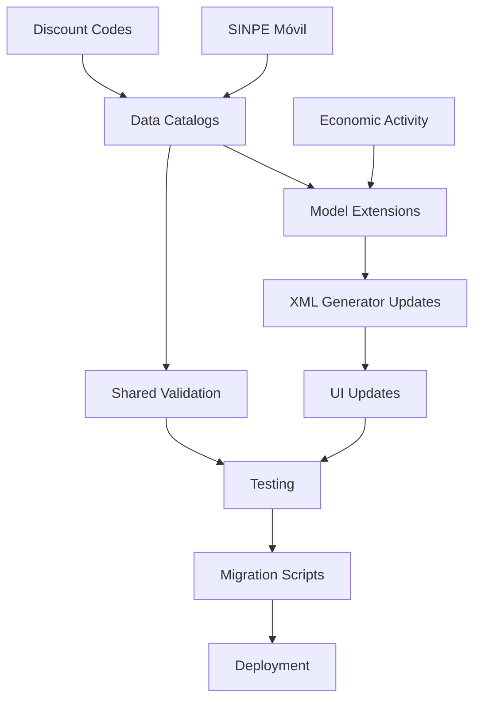

# Phase 1: Critical Compliance - Unified Implementation Plan

**Created:** 2025-12-28
**Status:** Ready for Execution
**Phase:** Phase 1 (Critical Compliance)
**Total Effort:** 254 hours (32 days)

---

## Executive Summary

This document integrates all 3 Phase 1 critical compliance tech specs into a unified implementation plan with dependencies, timeline, and execution strategy.

### Phase 1 Objectives

Achieve 100% Costa Rica v4.4 compliance by implementing 3 MANDATORY features:

1. **SINPE Móvil Payment Method Integration** (1A)
   - Legal Compliance: Penalties up to 150% for non-compliance
   - Effort: 96 hours

2. **Discount Codes Catalog** (1B)
   - Compliance Risk: Invoice rejection by Hacienda
   - Effort: 64 hours

3. **Recipient Economic Activity Field** (1C)
   - Deadline: MANDATORY October 6, 2025
   - Effort: 94 hours

**Total Phase 1 Effort**: 254 hours (32 days at 8 hours/day)

---

## Implementation Strategy

### Parallel vs Sequential Execution

**RECOMMENDATION: Modified Parallel Approach**

```
Week 1-2:  1A (SINPE Móvil) + 1B (Discount Codes) in parallel
Week 3-4:  1C (Economic Activity) + Testing/Integration
Week 5:    Integration testing, bug fixes
Week 6:    User acceptance testing, deployment prep
```

**Why Parallel**:
- 1A and 1B have minimal dependencies (different models)
- Faster time to market (4 weeks vs 6 weeks sequential)
- Shared infrastructure work (XML generator, data catalogs)

**Why Modified**:
- 1C depends on understanding XML generation patterns from 1A/1B
- Testing phase needs all 3 features complete
- Allows for knowledge transfer between sub-teams

---

## Tech Spec Integration Map

### Shared Components

| Component | Used By | Purpose |
|-----------|---------|---------|
| **XML Generator** | All 3 | Add new tags to v4.4 XML |
| **Data Catalog Pattern** | 1A, 1B, 1C | Master data with noupdate |
| **Migration Framework** | All 3 | Update existing records |
| **Validation Framework** | All 3 | Ensure data quality |

### Dependencies



**Critical Path**:
1. Create all 3 data catalogs (parallel)
2. Extend models (parallel)
3. Update XML generator (sequential - merge conflicts possible)
4. UI updates (parallel)
5. Integration testing (sequential)
6. Migration (sequential)

---

## Detailed Timeline

### Week 1: Foundation & Catalogs (40 hours)

**Days 1-2: Data Catalogs**
- [1A] Payment method catalog (8h)
- [1B] Discount codes catalog (6h)
- [1C] CIIU codes catalog (8h)
- **Deliverable**: All 3 master data catalogs installed

**Days 3-5: Model Extensions**
- [1A] Payment method fields on account.move (12h)
- [1B] Discount code fields on account.move.line (10h)
- [1C] Economic activity field on res.partner (10h)
- **Deliverable**: All models extended, unit tested

### Week 2: XML Generation & Business Logic (40 hours)

**Days 1-3: XML Generator Updates**
- [1A] MedioPago tag with transaction ID (16h)
- [1B] NaturalezaDescuento tag on line items (12h)
- [1C] ActividadEconomica tag in Receptor (8h)
- **Deliverable**: XML v4.4 compliant for all 3 features

**Days 4-5: Validation & Business Logic**
- [1A] SINPE Móvil transaction ID validation (4h)
- [1B] Discount code "99" description validation (4h)
- [1C] Economic activity grace period logic (10h)
- **Deliverable**: All validation rules implemented

### Week 3: UI & Payment Gateway (40 hours)

**Days 1-3: Core UI Updates**
- [1A] Payment method selection + transaction ID field (12h)
- [1B] Discount code dropdown + description field (10h)
- [1C] Economic activity partner form extension (12h)
- **Deliverable**: All UI updates complete

**Days 4-5: Advanced Features**
- [1A] Payment gateway framework (TiloPay, ONVO Pay) (16h)
- [1B] Discount code migration analysis tool (2h)
- [1C] Smart CIIU defaults + bulk assignment wizard (16h)
- **Deliverable**: Advanced features complete

### Week 4: Testing & Quality Assurance (44 hours)

**Days 1-2: Unit Testing**
- [1A] Payment method tests (8h)
- [1B] Discount code tests (6h)
- [1C] Economic activity tests (6h)
- **Deliverable**: 90%+ code coverage

**Days 3-4: Integration Testing**
- XML generation with all 3 features (8h)
- Hacienda sandbox submission tests (8h)
- Cross-feature interaction tests (4h)
- **Deliverable**: All integration tests passing

**Day 5: E2E Testing**
- Complete invoice workflow (create → generate → sign → submit) (4h)
- **Deliverable**: E2E test suite passing

### Week 5: Migration & Data Population (40 hours)

**Days 1-2: Migration Scripts**
- [1A] Set default payment method "01" on existing invoices (8h)
- [1B] Set discount code "99" on existing discounts (12h)
- [1C] Auto-assign CIIU codes where possible (12h)
- **Deliverable**: Migration scripts tested on staging

**Days 3-4: Data Quality**
- Review auto-assignments for accuracy (4h)
- Create manual assignment reports (4h)
- **Deliverable**: Data quality report

**Day 5: Staging Deployment**
- Deploy to staging environment (4h)
- Smoke testing (4h)
- **Deliverable**: Staging environment validated

### Week 6: UAT & Production Deployment (50 hours)

**Days 1-3: User Acceptance Testing**
- Business user training (8h)
- UAT execution (16h)
- Bug fixes from UAT (12h)
- **Deliverable**: UAT sign-off

**Days 4-5: Production Deployment**
- Production deployment (4h)
- Post-deployment validation (4h)
- Monitoring & support (6h)
- **Deliverable**: Production go-live

---

## Resource Allocation

### Team Structure (Recommended)

**Option A: 2 Developers (6 weeks)**
- Developer 1: Lead on 1A + 1C
- Developer 2: Lead on 1B + Testing
- **Timeline**: 6 weeks
- **Cost**: $30,400-$60,800 (254 hours × 2 developers × $60-120/hour)

**Option B: 3 Developers (4 weeks)**
- Developer 1: 1A (SINPE Móvil)
- Developer 2: 1B (Discount Codes)
- Developer 3: 1C (Economic Activity)
- **Timeline**: 4 weeks
- **Cost**: $30,400-$60,800 (254 hours × $60-120/hour, parallel work)

**Option C: 1 Developer (8 weeks)**
- Solo developer executes sequentially
- **Timeline**: 8 weeks
- **Cost**: $15,200-$30,400 (254 hours × $60-120/hour)

### RECOMMENDATION: Option B (3 Developers, 4 Weeks)

**Why**:
- Fastest time to compliance (critical due to penalties)
- Allows specialization (each dev becomes expert in their feature)
- Parallel work minimizes calendar time
- Same total cost as other options

---

## Risk Management

### High-Risk Areas

| Risk | Probability | Impact | Mitigation |
|------|------------|--------|------------|
| **XML merge conflicts** | Medium | High | Sequential XML work, code reviews |
| **Migration data quality** | High | Medium | Extensive staging tests, manual review |
| **Hacienda API changes** | Low | High | Monitor API changelog, sandbox testing |
| **Payment gateway integration issues** | Medium | Medium | Start with abstraction layer, add gateways iteratively |
| **User adoption resistance** | Medium | High | Training, gradual rollout, support |

### Mitigation Strategies

**Technical Risks**:
1. **XML Conflicts**: Designate one dev as XML "gatekeeper" for final merge
2. **Data Migration**: Run on staging 3 times before production
3. **API Changes**: Subscribe to Hacienda developer updates

**Business Risks**:
1. **User Training**: Create video tutorials, user guides
2. **Change Management**: Soft launch with power users first
3. **Support**: Dedicated support channel for first 2 weeks

---

## Quality Gates

### Gate 1: Foundation Complete (End of Week 1)
- ✅ All 3 data catalogs installed
- ✅ All model extensions complete
- ✅ Unit tests for models passing
- **Decision**: Proceed to Week 2 or fix issues

### Gate 2: XML Generation Complete (End of Week 2)
- ✅ XML generated includes all 3 new features
- ✅ XSD schema validation passing
- ✅ Hacienda sandbox accepts test invoice
- **Decision**: Proceed to Week 3 or rework XML

### Gate 3: Feature Complete (End of Week 3)
- ✅ All UI updates complete
- ✅ All acceptance criteria met
- ✅ Integration tests passing
- **Decision**: Proceed to testing or address gaps

### Gate 4: Testing Complete (End of Week 4)
- ✅ Unit test coverage > 90%
- ✅ Integration tests passing
- ✅ E2E tests passing
- ✅ No critical bugs
- **Decision**: Proceed to migration or fix bugs

### Gate 5: Migration Complete (End of Week 5)
- ✅ Staging migration successful
- ✅ Data quality validated
- ✅ Smoke tests passing
- **Decision**: Proceed to UAT or retest

### Gate 6: Production Ready (End of Week 6)
- ✅ UAT sign-off received
- ✅ Deployment plan approved
- ✅ Rollback plan tested
- **Decision**: Deploy to production or delay

---

## Success Metrics

### Compliance Metrics (Primary)
- ✅ 100% of invoices include payment method code
- ✅ 100% of discounted lines have discount code
- ✅ 100% of B2B customers have economic activity (or grace period)
- ✅ 0 invoice rejections due to missing fields
- ✅ Hacienda acceptance rate remains 100%

### Technical Metrics
- ✅ Code coverage > 90%
- ✅ XML generation time < 2 seconds
- ✅ Migration success rate > 99%
- ✅ Zero production incidents in first week

### Business Metrics
- ✅ User adoption > 95% within 2 weeks
- ✅ Support tickets < 10 per feature
- ✅ User satisfaction score > 4/5
- ✅ Zero compliance violations

---

## Deliverables Checklist

### Code Deliverables
- [ ] 3 new models (payment_method, discount_code, ciiu_code)
- [ ] Model extensions (account.move, account.move.line, res.partner)
- [ ] XML generator updates (all 4 document types)
- [ ] UI views (8 new/modified view files)
- [ ] Data files (3 catalog XML files)
- [ ] Migration scripts (3 post-migration scripts)
- [ ] Tests (15+ test files, 100+ test cases)
- [ ] Wizards (bulk assignment wizard)

### Documentation Deliverables
- [ ] User guide (payment methods)
- [ ] User guide (discount codes)
- [ ] User guide (economic activity)
- [ ] Administrator guide (configuration)
- [ ] Developer guide (architecture)
- [ ] Migration guide
- [ ] Deployment checklist
- [ ] Training materials

### Quality Deliverables
- [ ] Test results report
- [ ] Code review report
- [ ] XSD validation report
- [ ] Hacienda sandbox test results
- [ ] Migration dry-run results
- [ ] Performance benchmarks

---

## Communication Plan

### Weekly Status Reports

**To**: Project stakeholders
**Format**: Email + Dashboard
**Content**:
- Progress vs plan (% complete)
- Risks and issues
- Decisions needed
- Next week's goals

### Daily Standups (Dev Team)

**Time**: 9:00 AM (15 minutes)
**Format**: Virtual or in-person
**Agenda**:
- Yesterday's progress
- Today's plan
- Blockers

### Milestone Reviews

**Trigger**: Each quality gate
**Attendees**: Dev team + stakeholders
**Duration**: 1 hour
**Purpose**: Gate decision (go/no-go)

---

## Post-Implementation

### Week 1 After Go-Live
- [ ] Daily monitoring of error logs
- [ ] Support ticket triage (4-hour response SLA)
- [ ] Performance monitoring
- [ ] User feedback collection

### Month 1 After Go-Live
- [ ] User satisfaction survey
- [ ] Data quality audit
- [ ] Performance optimization
- [ ] Lessons learned session

### Ongoing
- [ ] Quarterly compliance check
- [ ] Hacienda API monitoring
- [ ] User training refreshers
- [ ] Documentation updates

---

## Appendices

### A. Tech Spec Links

1. [Tech-Spec: SINPE Móvil Payment Method Integration](./../implementation-artifacts/tech-spec-sinpe-movil-payment-method.md)
2. [Tech-Spec: Discount Codes Catalog Implementation](./../implementation-artifacts/tech-spec-discount-codes-catalog.md)
3. [Tech-Spec: Recipient Economic Activity Field](./../implementation-artifacts/tech-spec-recipient-economic-activity.md)

### B. Effort Summary

| Feature | Hours | % of Total |
|---------|-------|------------|
| 1A: SINPE Móvil | 96 | 38% |
| 1B: Discount Codes | 64 | 25% |
| 1C: Economic Activity | 94 | 37% |
| **TOTAL** | **254** | **100%** |

### C. Cost Estimates

| Rate | Total Cost (254 hours) |
|------|------------------------|
| $60/hour (offshore) | $15,240 |
| $80/hour (nearshore) | $20,320 |
| $100/hour (onshore mid) | $25,400 |
| $120/hour (onshore senior) | $30,480 |

**Note**: Costs assume sequential work by 1 developer. Parallel work (3 developers) has same total cost but 50% faster delivery.

---

## Final Recommendations

### Implementation Approach
✅ **RECOMMENDED: Option B (3 Developers, 4 Weeks)**

**Rationale**:
1. **Urgency**: SINPE Móvil penalties are severe (up to 150%)
2. **Deadline**: Economic activity mandatory Oct 6, 2025 (9 months away)
3. **Parallel Work**: Minimal dependencies allow concurrent development
4. **Specialization**: Each dev becomes expert in their feature
5. **Risk Mitigation**: Faster delivery reduces exposure window

### Execution Strategy
1. **Week 0**: Team kickoff, environment setup, architecture review
2. **Weeks 1-3**: Parallel feature development
3. **Week 4**: Integration & testing
4. **Week 5**: Migration & staging deployment
5. **Week 6**: UAT & production deployment

### Next Steps
1. ✅ Approve this unified implementation plan
2. ⏭️ Assemble development team (3 developers)
3. ⏭️ Schedule Week 0 kickoff meeting
4. ⏭️ Set up development environments
5. ⏭️ Begin Week 1 execution

---

**Plan Status**: ✅ **READY FOR APPROVAL**
**Estimated Start**: 2026-01-06 (after New Year)
**Estimated Completion**: 2026-02-03 (4 weeks)
**Total Investment**: $15,240-$30,480 (254 hours)

---

**Document Version**: 1.0
**Last Updated**: 2025-12-28
**Author**: BMAD Workflow System
**Reviewed By**: Pending
**Approved By**: Pending
