# UX Design Specification GMS

**Author:** Papu
**Date:** 2026-01-31
**Scope:** POS E-Invoice Feedback (focused scope -- backend UX deferred to later phase)

---

## Executive Summary

### Project Vision

GMS is a Costa Rica gym management platform built on Odoo 19 Enterprise. From a UX perspective, the core challenge is making Hacienda e-invoicing compliance **invisible** -- gym staff should process payments and invoices without thinking about XML schemas, digital signatures, or government APIs. The system handles compliance automatically; the user sees outcomes, not implementation.

The cardinal design rule: **everything must feel native to Odoo**. No custom UI components, no foreign patterns. We extend Odoo's existing design language (dialogs, notifications, status badges, button states) so that e-invoicing features are indistinguishable from Odoo's own features.

### Target Users

All users are **gym staff only** -- no gym members or external users interact with the e-invoicing module.

| Persona | Role | Primary Surface | Usage Pattern | Tech Level |
|---------|------|-----------------|---------------|------------|
| **Maria** (Receptionist) | Front desk, daily sales | POS | 20-50 transactions/day, speed-critical | Low-Medium |
| **Carlos** (Admin) | Operations, monthly billing | Backend | Daily invoice management, bulk operations | Medium-High |
| **Ana** (Owner) | Financial oversight | Dashboard | Weekly compliance checks, reports | Medium |
| **Luis** (Accountant) | Tax filing, auditing | Backend | Monthly/quarterly deep dives | High |

**Critical insight**: Maria (POS) needs sub-second feedback with zero cognitive load. Carlos and Luis (Backend) need detail and auditability. The same e-invoice data must surface differently depending on context.

### Key Design Challenges

1. **POS feedback gap** -- After payment + e-invoice submission, the cashier currently sees only "Payment Successful" (a generic Odoo payment message). No indication whether the Factura Electronica was accepted or rejected by Hacienda. If it failed, the cashier has no idea. Feedback must be **non-blocking on the happy path** -- a peripheral toast that confirms acceptance without requiring interaction (e.g., Odoo's `notification.add()` that fades in 3 seconds). Only rejection/errors should interrupt the flow with a brief, dismissable alert showing the reason. The cashier's priority is the next customer, not reading confirmation dialogs. **Don't add friction to the 95% happy path to handle the 5% error case.**

2. **Backend complexity overload** -- The current backend exposes 8 technical states, 6 manual action buttons, raw XML/JSON tabs, and 50-character cryptographic keys. Accountants need 3 states (Preparing / Sent / Approved), 1 action button ("Submit to Tax Authority"), and plain-language error messages. *(Deferred to later phase.)*

3. **Odoo-native constraint** -- All UI must use Odoo 19's existing component library: `AlertDialog`, `ConfirmationDialog`, `notification.add()`, CSS badge classes, `makeAwaitable()`, status bars, Bootstrap grid. This limits creativity but enforces consistency. Blueprint modules (Mexico's `l10n_mx_edi_pos`, Chile, Ecuador) prove these patterns are sufficient.

### Design Opportunities

1. **POS e-invoice feedback as differentiator** -- No competitor in the Costa Rica gym market shows real-time Hacienda status in the POS. A simple acceptance toast or rejection alert with the reason would immediately set GMS apart and build cashier confidence.

2. **3-state simplification** -- Collapsing 8 internal states into 3 user-facing states dramatically reduces cognitive load while keeping full technical detail accessible in Odoo's developer mode (`base.group_no_one`). *(Deferred to later phase.)*

3. **Guided error recovery** -- Instead of raw "XMLSchemaValidationError", show "Customer tax ID missing" with a direct link to the customer record. Turns support tickets into self-service actions. *(Backend portion deferred; POS portion in scope.)*

---

## Core User Experience

### Defining Experience

**Scope: POS e-invoice feedback only.** Backend UX improvements (3-state simplification, guided error recovery, dashboard) are deferred to a later phase.

The core experience is: **Maria takes a payment, the e-invoice happens invisibly, and she gets just enough feedback to know it worked -- without slowing down.**

Today's flow: Payment -> "Payment Successful" -> Receipt with "Documento Electronico" + clave -> New Order. The gap: zero feedback about Hacienda acceptance or rejection between "Payment Successful" and "New Order."

Target flow: Payment -> "Payment Successful" -> subtle toast confirming e-invoice status -> Receipt -> New Order. No extra clicks, no extra screens, no extra cognitive load.

### Platform Strategy

- **POS on Odoo 19** -- OWL framework, touch and desktop
- **Odoo-native components only**: `notification.add()` for toasts, `AlertDialog` for error interrupts
- **Blueprint reference**: Mexico's `l10n_mx_edi_pos` and Chile's patterns for post-payment e-invoice feedback
- No custom UI components, no new CSS unless Odoo has no equivalent

### Effortless Interactions

1. **Happy path (95% of transactions)**: A non-blocking toast notification appears after Hacienda accepts. It fades on its own in ~3 seconds. The cashier sees it peripherally. No tap/click required. She's already pressing "New Order."

2. **Error path (5% of transactions)**: A brief, dismissable alert appears with the rejection reason in plain language (e.g., "Factura rechazada: falta cedula del cliente"). The cashier can dismiss it and move on -- the error gets handled later by admin in the backend. The cashier is NOT expected to fix it.

3. **No new screens, no new buttons, no new steps** in the payment flow. The feedback is injected into the existing post-payment moment.

### Critical Success Moments

- **The toast**: Maria sees a small green notification "Factura Electronica aceptada" after payment. She doesn't stop, doesn't read it carefully -- she just registers "green = good" and moves on. That's the whole experience.
- **The alert on failure**: Maria sees a brief red/orange notification with a reason. She knows something went wrong but doesn't panic -- it's not her job to fix it. She tells Carlos later, or he catches it in his daily backend check.

### Experience Principles

1. **Speed over detail** -- In the POS, less information is better. A color and 3 words beats a paragraph.
2. **Don't block the line** -- Happy path feedback must never require interaction. Toast only.
3. **Errors inform, don't burden** -- The cashier learns something failed and why, but fixing it is someone else's job.
4. **Invisible compliance** -- The best e-invoice UX is one the cashier doesn't notice. It just works.

---

## Desired Emotional Response

### Primary Emotional Goals

**For Maria (POS cashier):**
- **Confidence**: "I know the invoice went through. Green = good."
- **Calm**: "Even when something fails, it's not my problem to solve right now."
- **Speed**: "Nothing slowed me down. The line keeps moving."

### Emotional Journey Mapping

| Moment | Current Emotion | Target Emotion |
|--------|----------------|----------------|
| Payment completes | Neutral ("done") | Confident ("done AND compliant") |
| E-invoice accepted | Unaware (no feedback) | Reassured (green toast, peripheral) |
| E-invoice rejected | Unaware (silent failure) | Informed but calm ("I see the warning, Carlos will handle it") |
| Next customer | Neutral | Uninterrupted flow |

### Micro-Emotions

- **Confidence over confusion**: The toast is unambiguous. Green = accepted. Red/orange = problem. No technical jargon.
- **Trust over skepticism**: The system handles compliance automatically. The cashier trusts it works.
- **Calm over anxiety**: Error messages don't alarm. They inform. "Factura rechazada" with a reason, not "ERROR: XMLSchemaValidation..."

### Design Implications

| Emotion | UX Choice |
|---------|-----------|
| Confidence | Green `notification.add()` with `type: 'success'` -- Odoo's native success toast |
| Calm on error | Orange/red `notification.add()` with `type: 'warning'` or `'danger'` -- auto-dismisses, no dialog |
| Speed | Toast appears and fades in 3-4 seconds. No click required. No modal. |
| Trust | Consistent -- every transaction shows feedback. Never silent. |

### Emotional Design Principles

1. **Color is communication** -- Green = accepted, orange = warning, red = rejected. No words needed at a glance.
2. **Silence breeds doubt** -- Always show feedback. Even "Enviando factura..." if async. Never leave the cashier wondering.
3. **Errors are not emergencies** -- The tone of rejection feedback should be informational, not alarming.

---

## UX Pattern Analysis & Inspiration

### Inspiring Products Analysis

**Odoo 19 POS itself** is the primary inspiration source. We're not looking at external apps -- we're looking at how Odoo's own localization modules handle this exact problem.

**Mexico (`l10n_mx_edi_pos`):**
- After payment, CFDI stamping happens synchronously
- Status is reflected on the order/receipt
- Uses Odoo's native notification system for feedback
- Pattern: submit during payment flow, show result immediately

**Chile (`l10n_cl_edi_pos`):**
- Fast SII response (similar to Costa Rica's Hacienda)
- Toast notification on acceptance
- Synchronous submission with immediate feedback

**Ecuador (`l10n_ec_edi_pos`):**
- "Final Consumer" default partner for anonymous sales (relevant for gym walk-ins buying day passes)
- Clean integration into existing POS payment flow

### Transferable UX Patterns

| Pattern | Source | How We'll Use It |
|---------|--------|-----------------|
| `notification.add()` success toast | Odoo core POS | Show "Factura Electronica aceptada" after Hacienda accepts |
| `notification.add()` warning toast | Odoo core POS | Show "Factura rechazada: [reason]" on rejection |
| Synchronous submission in payment flow | Mexico CFDI | Submit during `_process_order`, result available on receipt screen |
| Receipt prints e-invoice reference | All localizations | Already implemented -- clave + "Documento Electronico" on receipt |

### Anti-Patterns to Avoid

1. **Modal dialogs for success** -- Never use `AlertDialog` or `ConfirmationDialog` for happy path. These block the flow and require a click to dismiss.
2. **Technical jargon in notifications** -- No "XMLSchemaValidationError", no "ind-estado: aceptado", no raw API responses.
3. **Silent failures** -- The current behavior. Invoice submission fails and nobody knows until a customer complains.
4. **Custom notification UI** -- Don't build a custom toast component. Use Odoo's `notification.add()` service exactly as it exists.

### Design Inspiration Strategy

**Adopt directly from Odoo:**
- `notification.add(message, { type: 'success' })` for acceptance
- `notification.add(message, { type: 'danger' })` for rejection
- Notification auto-dismiss behavior (Odoo's default ~4 seconds)

**Adapt from Mexico/Chile:**
- Their submission timing (synchronous during payment flow)
- Their receipt-level status indicators

**Avoid:**
- Any pattern not native to Odoo 19 POS
- Any UI that would look different from standard Odoo notifications

---

## Design System Foundation

### Design System Choice

**Odoo 19's built-in design system.** There is no choice to make here. We are extending Odoo, not building a standalone app. Odoo 19 uses:

- **OWL framework** (Odoo Web Library) for components
- **Bootstrap 5** for grid, spacing, and utility classes
- **Font Awesome** for icons
- **Odoo's own SCSS variables** for colors and theming
- **POS-specific components**: `notification`, `dialog`, `AlertDialog`, `ConfirmationDialog`, `makeAwaitable`

### Rationale for Selection

This is not a recommendation -- it's a constraint. The cardinal rule states: "Our custom features must be indistinguishable from Odoo's own features." Using any other design system would violate this rule.

### Implementation Approach

- Use `useService("notification")` for toast notifications in POS
- Use Odoo's existing notification types: `success`, `warning`, `danger`, `info`
- No new CSS classes, no new components, no new patterns
- If Odoo's notification service doesn't support what we need, find another Odoo-native way -- don't invent one

### Customization Strategy

**None.** We use Odoo's design system as-is. The only "customization" is the content of the notifications (the text and type we pass to `notification.add()`).

---

## Defining Core Experience

### The Defining Interaction

**"Payment confirmed. Factura accepted."** -- That's the whole experience, delivered in a 3-second toast.

The defining interaction is not a new feature -- it's adding **one line of feedback** to an existing flow. Maria presses "Validate" to complete payment. Odoo shows "Payment Successful." Then, our toast appears: "Factura Electronica aceptada." She presses "New Order." Done.

### User Mental Model

Maria's mental model today:
- "I take payment. The system handles invoicing. I assume it works."
- "If something went wrong, I wouldn't know. That bothers me a little, but I don't think about it."

Maria's mental model after:
- "I take payment. I see green = invoice accepted. I move on."
- "If I see orange/red, something went wrong. I'll tell Carlos. Not my problem to fix."

### Success Criteria

| Criteria | Measure |
|----------|---------|
| Toast appears reliably | 100% of FE/TE transactions show feedback |
| Toast doesn't block | Cashier can press "New Order" before toast fades |
| Rejection is clear | Cashier can describe what went wrong in one sentence |
| No training needed | New cashier understands toast meaning on first sight (green = good, red = bad) |
| No extra clicks | Zero additional interactions added to payment flow |

### Experience Mechanics

**1. Initiation (automatic):**
- Cashier validates payment (existing Odoo flow)
- `_process_order` triggers e-invoice generation + submission (existing code)
- Hacienda responds with `aceptado` or `rechazado`

**2. Feedback (new -- the only new UX element):**
- On `aceptado`: `notification.add("Factura Electronica aceptada", { type: "success" })`
- On `rechazado`: `notification.add("Factura rechazada: [plain language reason]", { type: "danger", sticky: false })`
- On submission error: `notification.add("Error enviando factura -- se reintentara", { type: "warning" })`

**3. Completion:**
- Toast fades automatically (Odoo default ~4 seconds)
- Cashier is already on "New Order" screen
- No action required from cashier

---

## Visual Design Foundation

### Color System

**Odoo 19's existing color system.** No custom colors.

| Feedback Type | Odoo Notification Type | Color |
|---------------|----------------------|-------|
| Accepted | `success` | Green (Bootstrap `$success`) |
| Rejected | `danger` | Red (Bootstrap `$danger`) |
| Submission error / retry | `warning` | Orange (Bootstrap `$warning`) |
| Informational | `info` | Blue (Bootstrap `$info`) |

### Typography System

**Odoo 19's POS typography.** No custom fonts. The notification text uses Odoo's default POS font at its default size. Keep messages short enough to be read at a glance -- max 1 line.

### Spacing & Layout Foundation

**No layout changes.** The notification toast appears in Odoo's standard notification position (top-right in POS). We do not change its position, size, or z-index.

### Accessibility Considerations

- Notifications use Odoo's built-in ARIA roles (already implemented in Odoo's notification service)
- Color is not the only indicator -- text clearly states "aceptada" or "rechazada"
- Toast duration (~4 seconds) gives sufficient reading time
- Touch targets not applicable (toast is non-interactive on happy path)

---

## Design Direction Decision

### Design Directions Explored

Only one direction was considered: **Odoo-native notifications in the POS receipt screen.** This is not a visual design exercise -- it's an interaction design decision within a fixed visual framework.

### Chosen Direction

**Odoo `notification.add()` service** in the POS receipt/payment screen.

- **Happy path**: Green success toast, auto-dismiss
- **Error path**: Red danger toast with plain-language reason, auto-dismiss
- **Retry path**: Orange warning toast, auto-dismiss

No new UI elements. No new screens. No modals. No badges. Just Odoo's existing notification service with the right message and type.

### Design Rationale

1. **Zero development risk** -- `notification.add()` is battle-tested Odoo infrastructure
2. **Zero learning curve** -- Cashiers already see Odoo notifications for other events
3. **Zero visual design needed** -- Colors, positioning, animation all handled by Odoo
4. **Perfectly native** -- Indistinguishable from any other Odoo notification

### Implementation Approach

Patch the POS payment flow (likely in the `PaymentScreen` or post-order processing) to call `notification.add()` after the e-invoice submission response is received. The notification service is already available via `useService("notification")` in POS components.

---

## User Journey Flows

### Journey: POS Payment with Factura Electronica (Happy Path)

```mermaid
flowchart TD
    A[Cashier selects products] --> B[Cashier selects customer]
    B --> C[Cashier selects 'Factura Electronica']
    C --> D[Cashier processes payment]
    D --> E["Payment Successful" banner appears]
    E --> F[E-invoice submitted to Hacienda in background]
    F --> G{Hacienda response}
    G -->|aceptado| H["🟢 Toast: Factura Electronica aceptada"]
    G -->|rechazado| I["🔴 Toast: Factura rechazada: reason"]
    G -->|timeout/error| J["🟠 Toast: Error enviando -- se reintentara"]
    H --> K[Receipt prints with Documento Electronico + clave]
    I --> K
    J --> K
    K --> L[Cashier presses New Order]
    L --> M[Next customer]
```



**Key points:**
- Steps A-E are unchanged (existing Odoo POS flow)
- Step F already happens (existing code)
- Steps G-J are **new** -- the only UX addition
- Steps K-M are unchanged

### Journey: POS Payment with Tiquete Electronico (Anonymous)

```mermaid
flowchart TD
    A[Cashier selects products] --> B[No customer selected = Tiquete]
    B --> C[Cashier processes payment]
    C --> D["Payment Successful" banner]
    D --> E[Tiquete submitted to Hacienda]
    E --> F{Hacienda response}
    F -->|aceptado| G["🟢 Toast: Tiquete Electronico aceptado"]
    F -->|rechazado| H["🔴 Toast: Tiquete rechazado: reason"]
    G --> I[Receipt prints]
    H --> I
    I --> J[New Order]
```



### Journey: Rejection Handling (Post-POS)

```mermaid
flowchart TD
    A["🔴 Cashier saw rejection toast in POS"] --> B[Cashier continues serving customers]
    B --> C[Cashier mentions to Carlos later]
    C --> D[Carlos opens backend e-invoice list]
    D --> E[Carlos sees rejected document with reason]
    E --> F[Carlos fixes the issue]
    F --> G[Carlos resubmits from backend]
```



**Key point:** The POS cashier does NOT fix rejections. They just see the notification and move on. Error resolution is a backend workflow for Carlos.

### Journey Patterns

- **Feedback is always automatic** -- no cashier action triggers the toast
- **Feedback is always brief** -- max 1 line of text
- **Feedback never blocks** -- no modals, no required dismissals on happy path
- **Errors are informational, not actionable** in the POS context

### Flow Optimization Principles

1. **Zero added steps** to the existing POS payment flow
2. **Notification appears during the receipt screen** -- the natural pause point where cashier can glance at it
3. **If Hacienda is slow**, don't block the receipt screen. Show "Enviando..." and update when response arrives. If cashier already moved to New Order, that's fine -- the notification still appears.

---

## Component Strategy

### Design System Components

All components needed are **already available in Odoo 19 POS**:

| Component | Odoo Module | Usage |
|-----------|-------------|-------|
| `notification.add()` | `@web/core/notifications/notification_service` | Success/error/warning toasts |
| `useService("notification")` | OWL service injection | Access notification in POS components |

### Custom Components

**None.** Zero custom components needed. The entire POS e-invoice feedback feature is implemented by calling an existing Odoo service with the right parameters.

### Component Implementation Strategy

```javascript
// In the POS payment flow (patch or override)
const notification = useService("notification");

// After Hacienda response received:
if (response.state === 'accepted') {
    notification.add("Factura Electronica aceptada", { type: "success" });
} else if (response.state === 'rejected') {
    notification.add(`Factura rechazada: ${response.plain_reason}`, { type: "danger" });
} else if (response.state === 'error') {
    notification.add("Error enviando factura -- se reintentara", { type: "warning" });
}
```

### Implementation Roadmap

**Single phase -- this is a minimal change:**

1. Identify the exact POS code point where Hacienda response is available after payment
2. Add `notification.add()` call with appropriate message and type
3. Create a plain-language error message mapping (Hacienda error codes -> human-readable Spanish)
4. Test on POS (touch and desktop)

---

## UX Consistency Patterns

### Feedback Patterns

**E-invoice feedback in POS follows Odoo's existing notification pattern exactly:**

| Scenario | Notification Type | Message Template | Duration |
|----------|------------------|-----------------|----------|
| FE accepted | `success` | "Factura Electronica aceptada" | Auto-dismiss (~4s) |
| TE accepted | `success` | "Tiquete Electronico aceptado" | Auto-dismiss (~4s) |
| FE rejected | `danger` | "Factura rechazada: {reason}" | Auto-dismiss (~4s) |
| TE rejected | `danger` | "Tiquete rechazado: {reason}" | Auto-dismiss (~4s) |
| Submission error | `warning` | "Error enviando factura -- se reintentara" | Auto-dismiss (~4s) |
| NC accepted | `success` | "Nota de Credito aceptada" | Auto-dismiss (~4s) |

### Error Message Mapping

Plain-language translations of common Hacienda rejection reasons:

| Hacienda Error | POS Message (Spanish) |
|---------------|----------------------|
| Missing Receptor/Identificacion | "Falta cedula del cliente" |
| Invalid Receptor tax ID | "Cedula del cliente invalida" |
| Duplicate clave | "Factura duplicada" |
| Invalid XML structure | "Error interno -- contacte administrador" |
| Certificate expired | "Certificado vencido -- contacte administrador" |
| Service unavailable | "Hacienda no disponible -- se reintentara" |

**Rule:** If the error is something the cashier can't understand or fix, show a generic message and route to admin. Never expose technical details in the POS.

### Navigation Patterns

**No navigation changes.** The cashier doesn't navigate anywhere new. The toast appears on the current screen.

### Additional Patterns

**Notification stacking:** If multiple orders are processed quickly (batch mode), notifications should stack naturally using Odoo's built-in stacking behavior. No custom logic needed.

---

## Responsive Design & Accessibility

### Responsive Strategy

**Odoo POS is already responsive.** The `notification.add()` service renders correctly on:
- Desktop browsers (mouse/keyboard)
- Tablets (touch)
- POS terminals (touch)

No responsive design work needed -- Odoo handles it.

### Breakpoint Strategy

**Odoo's existing POS breakpoints apply.** Notification positioning adapts automatically.

### Accessibility Strategy

**Odoo's notification service already handles:**
- ARIA `role="alert"` on notification elements
- Screen reader announcement of notification content
- Sufficient color contrast (Bootstrap's color system meets WCAG AA)
- Text content accompanies color (message says "aceptada" or "rechazada", not just color)

**Our responsibility:**
- Keep messages concise and readable
- Use plain language (no jargon)
- Ensure messages make sense without seeing the color (for colorblind users)

### Testing Strategy

1. Test on actual POS hardware (touch terminal)
2. Test on tablet (iPad, Android tablet)
3. Test on desktop browser
4. Verify notification appears and auto-dismisses on each platform
5. Verify notification doesn't block "New Order" button
6. Verify rejection message is readable in ~4 seconds

### Implementation Guidelines

- Use `useService("notification")` -- don't import notification module directly
- Don't set custom duration -- use Odoo's default
- Don't set `sticky: true` for any POS e-invoice notification
- Keep messages under 60 characters for single-line readability on touch devices

---

## Workflow Completion

**Scope:** This UX design specification covers **POS e-invoice feedback only**. Backend UX improvements (3-state simplification, single-action buttons, plain-language error messages, dashboard redesign) are documented in the UX Audit (`docs/UX_AUDIT_COSTA_RICA_EINVOICING.md`) and deferred to a later phase.

**What this specification defines:**
- A non-blocking success toast for accepted e-invoices in POS
- A non-blocking error toast with plain-language reason for rejected e-invoices in POS
- A warning toast for submission errors/retries
- An error message mapping from Hacienda codes to plain Spanish
- User journey flows for happy path, rejection, and error handling
- Zero new UI components, zero new screens, zero added steps

**Implementation estimate:** This is a small, focused change -- adding `notification.add()` calls to the existing POS payment flow after the Hacienda response is received, plus a plain-language error message mapping table.

**Next steps:**
1. Create a tech spec for the implementation (identify exact code insertion points)
2. Implement the notification calls
3. Create the error message mapping
4. Test on POS hardware
