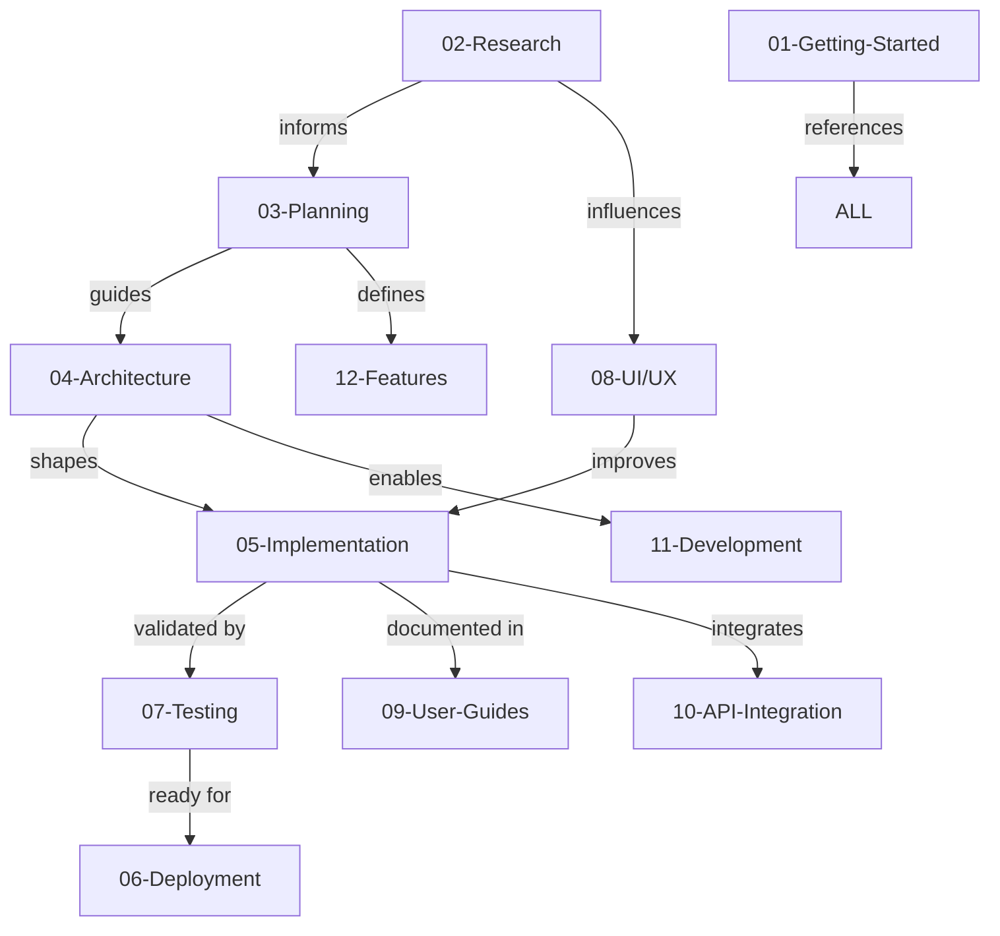

# 📍 Navigation Breadcrumb
[Home](index.md) > Documentation Graph

---

# 🕸️ Documentation Graph
**Semantic Relationships & Knowledge Map**

**Version:** 1.0.0
**Last Updated:** 2026-01-01
**Status:** ✅ Production Ready
**Owner:** Documentation Team

---

## 📊 Executive Summary

The Documentation Graph maps semantic relationships between documents, domains, and concepts in the GMS knowledge repository. Use this to understand how documentation connects, discover related content, and navigate the knowledge base efficiently.

**What This Graph Shows:**
- **Domain Relationships:** How 12 documentation domains relate to each other
- **Document Dependencies:** Which docs reference or depend on others
- **Concept Clusters:** Groups of docs covering related topics
- **User Journeys:** Typical reading paths for different roles
- **Integration Points:** Where different knowledge areas intersect

**Why This Matters:**
- **Discovery:** Find related docs you didn't know existed
- **Learning Paths:** Follow logical sequences for learning
- **Completeness:** Identify knowledge gaps
- **Navigation:** Understand where you are in the knowledge landscape
- **LLM Optimization:** Semantic connections help AI find relevant docs

---

## 🗺️ High-Level Domain Relationships

### Three-Tier Architecture

```
Level 1: Global Index (docs/index.md)
   ├─→ Entry point for all users
   ├─→ Role-based navigation
   └─→ Quick access to 12 domains

Level 2: Domain Indices (01-12 directories)
   ├─→ 01-getting-started
   ├─→ 02-research
   ├─→ 03-planning
   ├─→ 04-architecture
   ├─→ 05-implementation
   ├─→ 06-deployment
   ├─→ 07-testing
   ├─→ 08-ui-ux
   ├─→ 09-user-guides
   ├─→ 10-api-integration
   ├─→ 11-development
   └─→ 12-features

Level 3: Individual Documents
   └─→ Phase guides, tutorials, specs, reports
```

---

## 🔄 Domain Dependency Graph

### Primary Dependencies



### Relationship Legend

**→ informs:** Research findings shape planning decisions
**→ guides:** Planning defines technical architecture
**→ shapes:** Architecture determines implementation approach
**→ validated by:** Testing verifies implementation quality
**→ ready for:** Successful testing enables deployment
**→ defines:** Planning specifies features to build
**→ enables:** Architecture provides development patterns
**→ documented in:** Implementation creates user-facing docs
**→ influences:** Research guides UX decisions
**→ improves:** UX insights refine implementation
**→ integrates:** Implementation connects external services
**→ references:** Getting started links to all domains

---

## 📚 Domain-by-Domain Relationships

### 01 - Getting Started

**Connects To:**
- ALL domains (provides entry points)

**Provides:**
- Fast onboarding paths
- Role-based navigation
- Quick start scenarios
- Tutorials for common tasks

**Consumed By:**
- New users (all roles)
- Training programs
- Onboarding processes

**Key Documents:**
- [01-getting-started/index.md](01-getting-started/index.md) - Main index
- [QUICK-START-GUIDE.md](QUICK-START-GUIDE.md) - Fast scenarios

---

### 02 - Research

**Connects To:**
- 03-Planning (research informs product decisions)
- 08-UI/UX (competitive UX analysis)
- 10-API-Integration (provider research)
- 05-Implementation (technical requirements)

**Provides:**
- Market intelligence
- Competitive analysis
- Costa Rica compliance requirements
- User research insights

**Consumed By:**
- Product managers (planning features)
- Developers (understanding requirements)
- UX designers (design decisions)

**Key Documents:**
- [02-research/index.md](02-research/index.md) - Research hub
- [02-research/competitive/hulipractice/00-INTELLIGENCE-INDEX.md](02-research/competitive/hulipractice/00-INTELLIGENCE-INDEX.md) - Competitor analysis
- [02-research/costa-rica/00-COSTA-RICA-RESEARCH-INDEX.md](02-research/costa-rica/00-COSTA-RICA-RESEARCH-INDEX.md) - Compliance research

**Concept Clusters:**
1. **HuliPractice Intelligence** (4 layers: Forensic → Domain → Strategic → Action)
2. **Costa Rica Compliance** (Providers, Migration, Requirements)
3. **Market Research** (Gym landscape, pricing, trends)

---

### 03 - Planning

**Depends On:**
- 02-Research (market insights, user needs)
- 08-UI/UX (user research findings)

**Connects To:**
- 04-Architecture (technical approach)
- 05-Implementation (what to build)
- 12-Features (feature specifications)
- 07-Testing (acceptance criteria)

**Provides:**
- Product requirements (PRDs)
- Feature master list
- Implementation roadmap
- Success metrics

**Consumed By:**
- Product team (roadmap planning)
- Engineering (what to build)
- Stakeholders (business case)

**Key Documents:**
- [03-planning/index.md](03-planning/index.md) - Planning hub
- [GYM_MANAGEMENT_MASTER_FEATURE_LIST.md](../GYM_MANAGEMENT_MASTER_FEATURE_LIST.md) - Complete feature catalog
- [GYM_MANAGEMENT_ODOO_IMPLEMENTATION_PLAN.md](../GYM_MANAGEMENT_ODOO_IMPLEMENTATION_PLAN.md) - Implementation strategy

---

### 04 - Architecture

**Depends On:**
- 03-Planning (requirements, constraints)
- 02-Research (technical research)

**Connects To:**
- 11-Development (development patterns)
- 05-Implementation (implementation guidance)
- 10-API-Integration (integration architecture)
- 07-Testing (test architecture)

**Provides:**
- System design
- Technical decisions
- Module structure
- Integration patterns

**Consumed By:**
- Developers (implementation guidance)
- Tech leads (architectural decisions)
- DevOps (deployment architecture)

**Key Documents:**
- [04-architecture/index.md](04-architecture/index.md) - Architecture hub
- [GMS_MODULE_ARCHITECTURE_GUIDE.md](GMS_MODULE_ARCHITECTURE_GUIDE.md) - Module patterns
- [odoo-framework-deep-dive.md](odoo-framework-deep-dive.md) - Framework mastery

**Concept Clusters:**
1. **Modular Monolith Pattern** (Single deployment, multiple modules)
2. **Odoo-Native Development** (Leverage ORM, follow conventions)
3. **Integration Architecture** (Hacienda, TiloPay, POS patterns)

---

### 05 - Implementation

**Depends On:**
- 03-Planning (what to build)
- 04-Architecture (how to build)
- 11-Development (coding standards)

**Connects To:**
- 07-Testing (test validation)
- 09-User-Guides (user documentation)
- 12-Features (feature delivery)
- 06-Deployment (deployment artifacts)

**Provides:**
- Phase-by-phase delivery (9 phases)
- Code implementation
- Technical specifications
- Delivery summaries

**Consumed By:**
- Developers (implementation reference)
- QA (what was built)
- Documentation team (user guide material)

**Key Documents:**
- [05-implementation/index.md](05-implementation/index.md) - Implementation hub
- Phase guides: PHASE1A through PHASE9
- Delivery summaries: PHASE*-COMPLETE.md

**Concept Clusters:**
1. **Phase 1-3: Foundation** (Compliance basics, signatures, API)
2. **Phase 4-6: Enhancement** (UI/UX, PDF/Email, Analytics)
3. **Phase 7-9: Production** (Deployment, Void wizard, Tax reports)

---

### 06 - Deployment

**Depends On:**
- 05-Implementation (what to deploy)
- 04-Architecture (infrastructure design)
- 07-Testing (deployment validation)

**Connects To:**
- 11-Development (deployment procedures)
- 10-API-Integration (production credentials)

**Provides:**
- Production deployment guide
- Infrastructure configuration
- Security hardening
- Monitoring setup

**Consumed By:**
- DevOps engineers (deployment)
- System administrators (operations)
- Developers (deployment understanding)

**Key Documents:**
- [06-deployment/index.md](06-deployment/index.md) - Deployment hub
- [PRODUCTION-READINESS-REPORT.md](../PRODUCTION-READINESS-REPORT.md) - Complete guide
- [l10n_cr_einvoice/security/](../l10n_cr_einvoice/security/) - Security configs

**Concept Clusters:**
1. **Docker Infrastructure** (Containers, compose, orchestration)
2. **Security Hardening** (SSL, certificates, firewall)
3. **Monitoring & Backup** (Health checks, automated backups)

---

### 07 - Testing

**Depends On:**
- 05-Implementation (code to test)
- 03-Planning (acceptance criteria)

**Connects To:**
- 06-Deployment (deployment validation)
- 05-Implementation (test feedback loop)

**Provides:**
- Test results (100% compliance)
- Validation reports
- Test coverage metrics
- Quality assurance

**Consumed By:**
- QA engineers (testing procedures)
- Developers (test results)
- Stakeholders (quality proof)

**Key Documents:**
- [07-testing/index.md](07-testing/index.md) - Testing hub
- [100-PERCENT-COMPLIANCE-ACHIEVED.md](../100-PERCENT-COMPLIANCE-ACHIEVED.md) - Validation proof
- Test scripts: test_*.py files

**Concept Clusters:**
1. **Unit Testing** (96% average coverage)
2. **Integration Testing** (E2E flows)
3. **Compliance Testing** (Hacienda validation)

---

### 08 - UI/UX

**Depends On:**
- 02-Research (user research, competitive analysis)

**Connects To:**
- 03-Planning (UX influences features)
- 05-Implementation (UX improvements)
- 09-User-Guides (user-centered docs)

**Provides:**
- User research findings
- UX audit results
- Design specifications
- UI patterns

**Consumed By:**
- Designers (design decisions)
- Developers (implementation guidance)
- Product team (feature prioritization)

**Key Documents:**
- [08-ui-ux/index.md](08-ui-ux/index.md) - UI/UX hub
- [USER_RESEARCH_GYM_OWNERS_2025.md](USER_RESEARCH_GYM_OWNERS_2025.md) - User insights
- [UX_AUDIT_COSTA_RICA_EINVOICING.md](UX_AUDIT_COSTA_RICA_EINVOICING.md) - UX evaluation

**Concept Clusters:**
1. **User Personas** (Gym owner, front desk, member)
2. **UX Patterns** (Filter sidebar, status badges, inline editing)
3. **Design System** (Colors, typography, spacing)

---

### 09 - User Guides

**Depends On:**
- 05-Implementation (features to document)
- 08-UI/UX (user-centered approach)

**Connects To:**
- 01-Getting-Started (onboarding content)
- 12-Features (feature-specific guides)

**Provides:**
- Quick start guides (all phases)
- Quick reference cards
- Admin guides
- Troubleshooting

**Consumed By:**
- End users (daily operations)
- Training programs
- Support team (help resources)

**Key Documents:**
- [09-user-guides/index.md](09-user-guides/index.md) - User guides hub
- Phase quick starts: PHASE*-QUICK-START.md
- Quick references: PHASE*-QUICK-REFERENCE.md

**Concept Clusters:**
1. **Phase-by-Phase Guides** (1A through 9)
2. **Quick References** (One-page cheat sheets)
3. **Admin Guides** (System configuration)

---

### 10 - API Integration

**Depends On:**
- 04-Architecture (integration patterns)
- 02-Research (provider research)

**Connects To:**
- 05-Implementation (API implementation)
- 11-Development (API development)
- 06-Deployment (production credentials)

**Provides:**
- API specifications
- Integration guides
- Authentication patterns
- Webhook handling

**Consumed By:**
- Developers (API integration)
- System admins (API configuration)

**Key Documents:**
- [10-api-integration/index.md](10-api-integration/index.md) - API hub
- [POS_EINVOICE_INTEGRATION_SPEC.md](POS_EINVOICE_INTEGRATION_SPEC.md) - POS integration

**Concept Clusters:**
1. **Hacienda API** (Certificate auth, XML submission, polling)
2. **TiloPay API** (Payment gateway, webhooks, refunds)
3. **POS Integration** (Offline queue, auto e-invoice)

---

### 11 - Development

**Depends On:**
- 04-Architecture (development patterns)

**Connects To:**
- 05-Implementation (what was built)
- 07-Testing (testing procedures)
- 06-Deployment (deployment understanding)

**Provides:**
- Environment setup
- Coding standards
- Git workflow
- Troubleshooting

**Consumed By:**
- Developers (daily development)
- New team members (onboarding)

**Key Documents:**
- [11-development/index.md](11-development/index.md) - Development hub
- [MODULE_CLONING_QUICK_REFERENCE.md](MODULE_CLONING_QUICK_REFERENCE.md) - Quick guide

**Concept Clusters:**
1. **Setup & Configuration** (Docker, Odoo, PostgreSQL)
2. **Coding Standards** (Python, XML, JavaScript)
3. **Git Workflow** (Branching, commits, reviews)

---

### 12 - Features

**Depends On:**
- 03-Planning (feature definitions)
- 05-Implementation (feature delivery)

**Connects To:**
- 09-User-Guides (usage documentation)
- 07-Testing (feature validation)

**Provides:**
- Feature-specific documentation
- User guides per feature
- Technical specifications
- Migration guides

**Consumed By:**
- Users (feature usage)
- Developers (feature understanding)
- Support team (feature support)

**Key Documents:**
- [12-features/index.md](12-features/index.md) - Features hub
- Feature docs: XML Import, Void Wizard, Tax Reports, etc.

**Concept Clusters:**
1. **E-Invoice Features** (XML import, void wizard, PDF/email)
2. **Payment Features** (TiloPay, SINPE, recurring)
3. **Reporting Features** (Analytics, tax reports)

---

## 🎯 User Journey Maps

### Journey 1: New Gym Owner (First-Time User)

```
Path: Business Overview → Setup → First Invoice → Daily Operations

1. Start: [01-getting-started/index.md](01-getting-started/index.md)
   ├─→ Choose "I'm a Gym Owner" path
   └─→ Read business overview

2. Understand Compliance: [02-research/costa-rica/00-COSTA-RICA-RESEARCH-INDEX.md](02-research/costa-rica/00-COSTA-RICA-RESEARCH-INDEX.md)
   ├─→ Costa Rica e-invoicing explained
   └─→ Why compliance matters

3. Quick Setup: [QUICK-START-GUIDE.md](QUICK-START-GUIDE.md)
   ├─→ 30-minute basic configuration
   ├─→ Install certificate
   └─→ Configure company

4. First Invoice: [QUICK-START-GUIDE.md#create-invoice](QUICK-START-GUIDE.md#15-minute-start-create-your-first-invoice)
   ├─→ Create first Costa Rica invoice
   └─→ Submit to Hacienda

5. Daily Use: [09-user-guides/index.md](09-user-guides/index.md)
   ├─→ Accept payments
   ├─→ POS sales
   └─→ View analytics

6. Advanced: [12-features/index.md](12-features/index.md)
   ├─→ Void wizard
   ├─→ Tax reports
   └─→ Migration tools
```

**Estimated Time:** 2 hours to first invoice, 1 day to proficiency

---

### Journey 2: Developer (New to Project)

```
Path: Architecture → Setup → Code → Test → Deploy

1. Start: [01-getting-started/index.md](01-getting-started/index.md)
   └─→ Choose "I'm a Developer" path

2. Understand Architecture: [04-architecture/index.md](04-architecture/index.md)
   ├─→ System design
   ├─→ Modular monolith pattern
   └─→ Odoo framework deep dive

3. Setup Environment: [11-development/index.md](11-development/index.md)
   ├─→ Install Odoo 19, PostgreSQL, Redis
   ├─→ Clone repository
   └─→ Run locally

4. Learn Implementation: [05-implementation/index.md](05-implementation/index.md)
   ├─→ Read phase guides (1-9)
   ├─→ Understand code structure
   └─→ Review coding standards

5. Integrate APIs: [10-api-integration/index.md](10-api-integration/index.md)
   ├─→ Hacienda API flow
   ├─→ TiloPay integration
   └─→ POS integration

6. Test: [07-testing/index.md](07-testing/index.md)
   ├─→ Run test suite
   ├─→ Write new tests
   └─→ Validate coverage

7. Deploy: [06-deployment/index.md](06-deployment/index.md)
   ├─→ Docker setup
   └─→ Production deployment
```

**Estimated Time:** 1 day to environment setup, 1 week to full productivity

---

### Journey 3: Front Desk Staff (Daily Operations)

```
Path: Quick Start → Daily Tasks → Troubleshooting

1. Start: [01-getting-started/index.md](01-getting-started/index.md)
   └─→ Choose "I'm Front Desk Staff" path

2. Quick Training: [QUICK-START-GUIDE.md](QUICK-START-GUIDE.md)
   ├─→ Create invoice (15 min)
   ├─→ Accept payment (3 min)
   ├─→ POS sale (2 min)
   └─→ Void invoice (5 min)

3. Daily Reference: [09-user-guides/index.md](09-user-guides/index.md)
   ├─→ Phase quick starts
   └─→ Quick reference cards

4. Troubleshooting: [09-user-guides/index.md#troubleshooting](09-user-guides/index.md)
   ├─→ Common issues
   └─→ Solutions

5. Advanced Tasks: [12-features/index.md](12-features/index.md)
   ├─→ Member discounts
   ├─→ Recurring billing
   └─→ Offline POS
```

**Estimated Time:** 1 hour to first invoice, 1 week to confident daily use

---

### Journey 4: System Administrator (Setup & Maintenance)

```
Path: Infrastructure → Security → Monitoring → Maintenance

1. Start: [01-getting-started/index.md](01-getting-started/index.md)
   └─→ Choose "I'm a System Administrator" path

2. Infrastructure: [06-deployment/index.md](06-deployment/index.md)
   ├─→ Server requirements
   ├─→ Docker setup
   └─→ Database configuration

3. Security: [06-deployment/index.md#security-configuration](06-deployment/index.md#security-configuration)
   ├─→ SSL/TLS setup
   ├─→ Firewall rules
   └─→ Certificate management

4. Deploy: [PRODUCTION-READINESS-REPORT.md](../PRODUCTION-READINESS-REPORT.md)
   ├─→ Complete deployment checklist
   └─→ Post-deployment validation

5. Monitor: [06-deployment/index.md#monitoring--observability](06-deployment/index.md#monitoring--observability)
   ├─→ Health checks
   ├─→ Logging
   └─→ Alerting

6. Maintain: [09-user-guides/index.md](09-user-guides/index.md)
   ├─→ Admin guide
   ├─→ Backup procedures
   └─→ Update procedures
```

**Estimated Time:** 2 hours to production deployment (experienced admin)

---

## 🧩 Concept Clusters

### Cluster 1: Costa Rica E-Invoicing Compliance

**Core Concepts:**
- Hacienda v4.4 XML format
- Digital signatures (BCCR certificates)
- 50-digit clave (unique identifier)
- Consecutive numbering preservation
- Document types (01 invoice, 03 credit note, 04 ticket)

**Related Documents:**
- [02-research/costa-rica/compliance-requirements.md](02-research/costa-rica/compliance-requirements.md)
- [10-api-integration/index.md#hacienda-api](10-api-integration/index.md)
- [05-implementation/index.md#phase-3](05-implementation/index.md)
- [QUICK-START-GUIDE.md#create-invoice](QUICK-START-GUIDE.md)

**Learning Path:**
1. Read compliance requirements (research)
2. Understand technical implementation (architecture)
3. See code implementation (implementation phase 3)
4. Try creating invoice (quick start guide)

---

### Cluster 2: Payment Processing

**Core Concepts:**
- TiloPay payment gateway
- SINPE Móvil integration
- Multiple payment methods
- Partial payments
- Refunds and voids

**Related Documents:**
- [10-api-integration/index.md#tilopay-payment-gateway](10-api-integration/index.md)
- [05-implementation/index.md#phase-2](05-implementation/index.md)
- [12-features/index.md#tilopay](12-features/index.md)
- [QUICK-START-GUIDE.md#accept-payment](QUICK-START-GUIDE.md)

**Learning Path:**
1. Understand payment gateway architecture
2. See TiloPay integration implementation
3. Configure payment methods
4. Process first payment

---

### Cluster 3: POS & Member Management

**Core Concepts:**
- Point-of-sale workflow
- Member discounts
- Offline mode
- Auto e-invoice generation
- Product catalog

**Related Documents:**
- [POS_EINVOICE_INTEGRATION_SPEC.md](./POS_EINVOICE_INTEGRATION_SPEC.md)
- [05-implementation/index.md#phase-1-3](05-implementation/index.md)
- [12-features/index.md#pos-membership](12-features/index.md)
- [QUICK-START-GUIDE.md#pos-sale](QUICK-START-GUIDE.md)

**Learning Path:**
1. Read POS integration spec
2. Understand member discount logic
3. Configure POS session
4. Make first POS sale

---

### Cluster 4: Tax Reporting

**Core Concepts:**
- D-101 (Income Tax Report)
- D-150 (VAT Report)
- D-151 (Informative Report)
- XML generation for Hacienda
- Monthly/quarterly filing

**Related Documents:**
- [05-implementation/index.md#phase-9](05-implementation/index.md)
- [12-features/index.md#tax-reports](12-features/index.md)
- [QUICK-START-GUIDE.md#tax-reports](QUICK-START-GUIDE.md)

**Learning Path:**
1. Understand tax report requirements
2. See implementation (Phase 9)
3. Generate first report
4. Submit to Hacienda portal

---

### Cluster 5: Migration & Onboarding

**Core Concepts:**
- XML import (historical invoices)
- Consecutive number preservation
- Provider switching
- Data migration
- Training materials

**Related Documents:**
- [12-features/index.md#xml-import](12-features/index.md)
- [l10n_cr_einvoice/docs/XML_IMPORT_USER_GUIDE.md](../l10n_cr_einvoice/docs/XML_IMPORT_USER_GUIDE.md)
- [02-research/costa-rica/migration-best-practices.md](02-research/costa-rica/migration-best-practices.md)

**Learning Path:**
1. Read migration research
2. Understand consecutive numbering requirement
3. Use XML import wizard
4. Validate imported data

---

## 🔍 Discovery Paths

### "I Need to Understand Compliance"

**Path:**
```
START: What is Costa Rica e-invoicing?
  ├─→ [02-research/costa-rica/compliance-requirements.md]
  ├─→ [QUICK-START-GUIDE.md#costa-rica-e-invoicing-101]
  └─→ [10-api-integration/index.md#hacienda-api]

NEXT: How do I comply?
  ├─→ [QUICK-START-GUIDE.md#install-certificate]
  ├─→ [QUICK-START-GUIDE.md#create-invoice]
  └─→ [09-user-guides/index.md]

ADVANCED: What are the technical details?
  ├─→ [04-architecture/index.md]
  ├─→ [05-implementation/index.md#phase-3]
  └─→ [10-api-integration/index.md]
```

### "I Want to Build a Feature"

**Path:**
```
START: What features exist?
  ├─→ [03-planning/index.md#feature-master-list]
  └─→ [12-features/index.md]

NEXT: How was it architected?
  ├─→ [04-architecture/index.md]
  ├─→ [GMS_MODULE_ARCHITECTURE_GUIDE.md]
  └─→ [odoo-framework-deep-dive.md]

IMPLEMENT: How do I code it?
  ├─→ [11-development/index.md#coding-standards]
  ├─→ [05-implementation/index.md] (learn from phases)
  └─→ [MODULE_CLONING_QUICK_REFERENCE.md]

TEST: How do I validate?
  ├─→ [07-testing/index.md]
  └─→ [11-development/index.md#testing-setup]

DEPLOY: How do I ship it?
  ├─→ [06-deployment/index.md]
  └─→ [PRODUCTION-READINESS-REPORT.md]
```

### "I'm Troubleshooting an Issue"

**Path:**
```
START: What's the error?
  ├─→ [09-user-guides/index.md#troubleshooting]
  └─→ [11-development/index.md#troubleshooting]

UNDERSTAND: How does this work?
  ├─→ [04-architecture/index.md] (understand system)
  ├─→ [05-implementation/index.md] (see how it was built)
  └─→ [10-api-integration/index.md] (check API issues)

FIX: How do I resolve this?
  ├─→ [11-development/index.md] (dev fixes)
  ├─→ [06-deployment/index.md] (infrastructure fixes)
  └─→ [QUICK-START-GUIDE.md#emergency-scenarios]

PREVENT: How do I avoid this?
  ├─→ [07-testing/index.md] (add tests)
  ├─→ [06-deployment/index.md#monitoring] (add monitoring)
  └─→ [DOCUMENTATION-STANDARDS.md] (document solution)
```

---

## 📊 Document Reference Matrix

### Who Uses What

| Document | Gym Owner | Front Desk | Developer | Admin | Product |
|----------|-----------|------------|-----------|-------|---------|
| **Getting Started** | ✅ Primary | ✅ Primary | ✅ Primary | ✅ Primary | ⚪ Reference |
| **Quick Start** | ✅ Daily | ✅ Daily | ⚪ Onboarding | ✅ Setup | ⚪ Demo |
| **Research** | ⚪ Context | ❌ N/A | ⚪ Reference | ❌ N/A | ✅ Primary |
| **Planning** | ⚪ Roadmap | ❌ N/A | ⚪ Context | ❌ N/A | ✅ Primary |
| **Architecture** | ❌ N/A | ❌ N/A | ✅ Primary | ⚪ Reference | ⚪ Review |
| **Implementation** | ❌ N/A | ❌ N/A | ✅ Primary | ⚪ Reference | ⚪ Review |
| **Deployment** | ❌ N/A | ❌ N/A | ⚪ Understanding | ✅ Primary | ❌ N/A |
| **Testing** | ❌ N/A | ❌ N/A | ✅ Daily | ⚪ Validation | ⚪ Quality |
| **UI/UX** | ⚪ Feedback | ⚪ Feedback | ⚪ Reference | ❌ N/A | ✅ Primary |
| **User Guides** | ✅ Reference | ✅ Daily | ⚪ Context | ✅ Reference | ⚪ Review |
| **API Integration** | ❌ N/A | ❌ N/A | ✅ Primary | ✅ Config | ⚪ Review |
| **Development** | ❌ N/A | ❌ N/A | ✅ Primary | ⚪ Understanding | ❌ N/A |
| **Features** | ✅ Reference | ✅ Daily | ⚪ Context | ⚪ Support | ✅ Planning |

**Legend:**
- ✅ **Primary:** Core documentation for this role
- ⚪ **Reference:** Occasional reference, supporting info
- ❌ **N/A:** Not relevant for this role

---

## 🎓 Learning Sequences

### Sequence 1: Costa Rica Compliance (For Non-Technical Users)

**Goal:** Understand and use e-invoicing compliance

1. **Conceptual** (30 min)
   - [QUICK-START-GUIDE.md#costa-rica-e-invoicing-101]
   - [02-research/costa-rica/compliance-requirements.md]

2. **Practical** (1 hour)
   - [QUICK-START-GUIDE.md#create-invoice]
   - [09-user-guides/PHASE2-QUICK-START.md]
   - [09-user-guides/PHASE3-QUICK-START.md]

3. **Advanced** (2 hours)
   - [12-features/index.md#xml-import] (migration)
   - [12-features/index.md#void-wizard] (corrections)
   - [12-features/index.md#tax-reports] (filing)

**Total Time:** 3.5 hours to compliance mastery

---

### Sequence 2: Technical Implementation (For Developers)

**Goal:** Build and deploy e-invoicing features

1. **Foundation** (4 hours)
   - [04-architecture/index.md]
   - [GMS_MODULE_ARCHITECTURE_GUIDE.md]
   - [odoo-framework-deep-dive.md]

2. **Implementation** (8 hours)
   - [05-implementation/index.md] (all 9 phases)
   - [11-development/index.md#coding-standards]
   - Study phase code implementations

3. **Integration** (4 hours)
   - [10-api-integration/index.md#hacienda-api]
   - [10-api-integration/index.md#tilopay-api]
   - [POS_EINVOICE_INTEGRATION_SPEC.md]

4. **Testing & Deployment** (4 hours)
   - [07-testing/index.md]
   - [06-deployment/index.md]
   - [PRODUCTION-READINESS-REPORT.md]

**Total Time:** 20 hours to full technical proficiency

---

## 🔗 Integration Points

### Cross-Domain Knowledge Intersections

**1. Compliance Implementation**
```
Intersection of:
- 02-Research (compliance requirements)
- 04-Architecture (technical design)
- 05-Implementation (code delivery)
- 10-API-Integration (Hacienda API)

Key Documents:
- Costa Rica compliance research
- Hacienda API integration spec
- Phase 3 implementation guide
```

**2. User Experience**
```
Intersection of:
- 02-Research (user research, HuliPractice)
- 08-UI/UX (design decisions)
- 05-Implementation (UX improvements)
- 09-User-Guides (documentation)

Key Documents:
- USER_RESEARCH_GYM_OWNERS_2025.md
- UX_AUDIT_COSTA_RICA_EINVOICING.md
- Phase 4 UI/UX improvements
```

**3. Deployment Pipeline**
```
Intersection of:
- 05-Implementation (what to deploy)
- 07-Testing (validation)
- 06-Deployment (how to deploy)
- 11-Development (deployment understanding)

Key Documents:
- PRODUCTION-READINESS-REPORT.md
- Testing validation reports
- Docker deployment guides
```

---

## ✅ Documentation Graph Status

**Status:** ✅ **PRODUCTION READY - v1.0.0**

**Coverage:**
- ✅ Domain relationships mapped
- ✅ User journeys documented
- ✅ Concept clusters identified
- ✅ Discovery paths defined
- ✅ Learning sequences created
- ✅ Reference matrix complete

**Usage:**
- Helps users discover related content
- Guides learning paths
- Shows semantic connections
- Enables efficient navigation

**Maintenance:**
- Update when new domains added
- Refresh user journeys quarterly
- Add new concept clusters as needed

**Last Update:** 2026-01-01
**Next Review:** 2026-04-01 (Quarterly)

---

**🕸️ Documentation Graph Maintained By:** GMS Documentation Team
**Version:** 1.0.0
**Last Updated:** 2026-01-01
