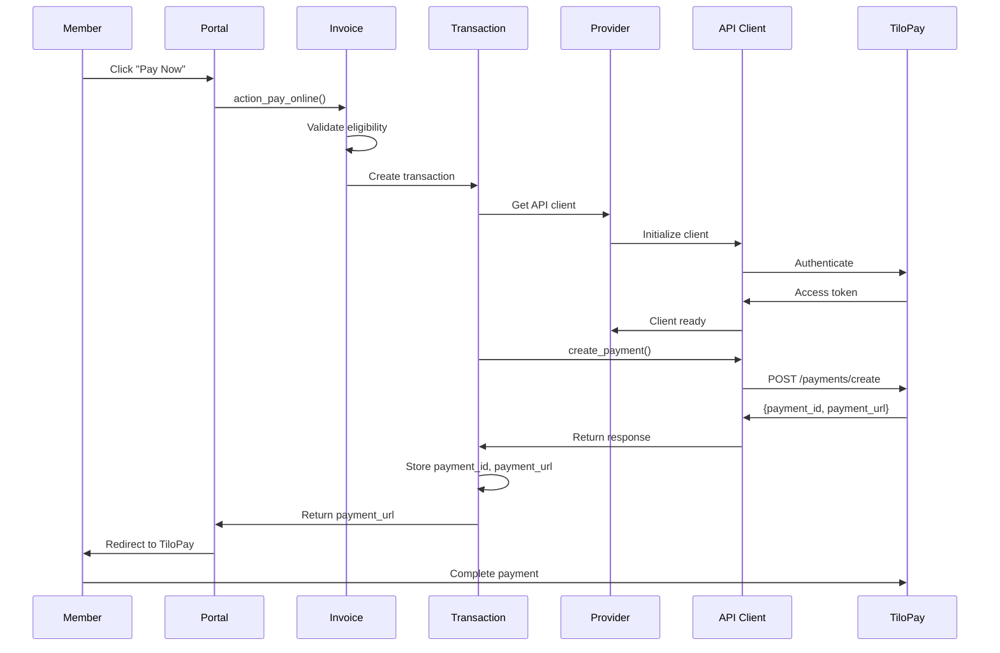
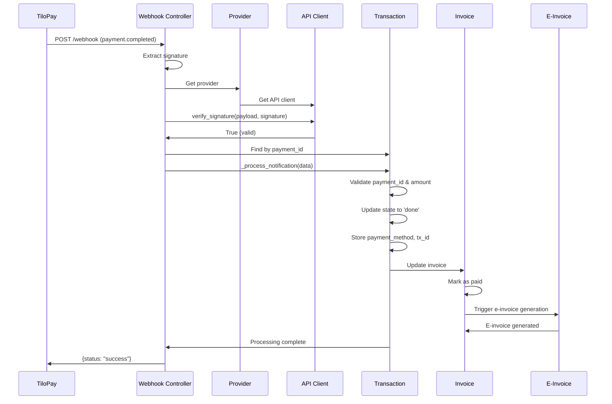
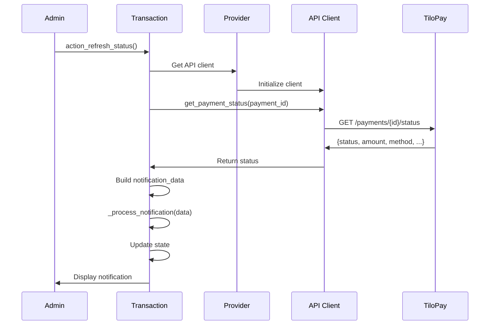

# TiloPay Payment Gateway - Architecture Documentation

**Version:** 1.0.0
**Last Updated:** 2025-12-28
**Target Audience:** Developers, Architects, Technical Leads

---

## Table of Contents

1. [System Overview](#system-overview)
2. [Architecture Diagrams](#architecture-diagrams)
3. [Component Design](#component-design)
4. [Data Flow](#data-flow)
5. [Integration Points](#integration-points)
6. [State Management](#state-management)
7. [Performance Considerations](#performance-considerations)
8. [Scalability](#scalability)

---

## System Overview

The TiloPay Payment Gateway module integrates Costa Rica's TiloPay payment platform with Odoo 19, enabling online payments for invoices and memberships with automatic e-invoice generation.

### Key Capabilities

- **Payment Processing**: SINPE Móvil and credit/debit card payments
- **Real-time Notifications**: Webhook-based payment confirmations
- **E-Invoice Integration**: Automatic e-invoice generation after successful payment
- **Member Portal**: Self-service payment interface for gym members
- **Audit Trail**: Complete transaction history and logging

### Technology Stack

- **Backend**: Python 3.10+, Odoo 19 Framework
- **HTTP Client**: Python `requests` library
- **Security**: HMAC-SHA256 webhook signatures
- **Database**: PostgreSQL (via Odoo ORM)
- **External API**: TiloPay REST API v1

---

## Architecture Diagrams

### System Architecture

```
┌─────────────────────────────────────────────────────────────────┐
│                         ODOO 19 SYSTEM                          │
├─────────────────────────────────────────────────────────────────┤
│                                                                 │
│  ┌──────────────┐      ┌──────────────┐      ┌──────────────┐ │
│  │   Member     │      │    Admin     │      │  Automated   │ │
│  │   Portal     │      │  Interface   │      │   Jobs       │ │
│  └──────┬───────┘      └──────┬───────┘      └──────┬───────┘ │
│         │                     │                     │         │
│         └──────────┬──────────┴──────────┬──────────┘         │
│                    │                     │                    │
│         ┌──────────▼─────────────────────▼──────────┐         │
│         │     Payment Transaction Model             │         │
│         │  (payment.transaction extended)           │         │
│         └──────────┬────────────────────────────────┘         │
│                    │                                          │
│         ┌──────────▼─────────────────────────────────┐        │
│         │    Payment Provider Model                  │        │
│         │  (payment.provider extended)               │        │
│         └──────────┬─────────────────────────────────┘        │
│                    │                                          │
│         ┌──────────▼─────────────────────────────────┐        │
│         │    TiloPay API Client                      │        │
│         │  (Low-level HTTP wrapper)                  │        │
│         └──────────┬─────────────────────────────────┘        │
│                    │                                          │
└────────────────────┼──────────────────────────────────────────┘
                     │
                     │ HTTPS (REST API)
                     │
         ┌───────────▼────────────┐
         │                        │
         │   TiloPay Gateway      │
         │   (External Service)   │
         │                        │
         └───────────┬────────────┘
                     │
         ┌───────────▼────────────┐
         │   Customer's Bank      │
         │   (SINPE / Card)       │
         └────────────────────────┘
```

### Module Structure

```
payment_tilopay/
│
├── models/                          # Business Logic Layer
│   ├── __init__.py
│   ├── tilopay_api_client.py       # ┐
│   │   └── TiloPayAPIClient        # │ API Abstraction
│   │                                # ┘
│   ├── tilopay_payment_provider.py # ┐
│   │   └── PaymentProvider         # │
│   │       (extends payment.provider)# │ Odoo Models
│   │                                # │
│   ├── tilopay_payment_transaction.py│
│   │   └── PaymentTransaction      # │
│   │       (extends payment.transaction)│
│   │                                # │
│   └── account_move.py              # │
│       └── AccountMove              # │
│           (extends account.move)   # ┘
│
├── controllers/                     # HTTP Layer
│   ├── __init__.py
│   └── tilopay_webhook.py          # ┐
│       └── TiloPayWebhookController # │ HTTP Endpoints
│                                    # ┘
│
├── views/                           # UI Layer
│   ├── payment_provider_views.xml   # Admin configuration
│   ├── payment_transaction_views.xml# Transaction management
│   └── portal_invoice_views.xml     # Member portal
│
├── data/                            # Data Layer
│   └── payment_provider_data.xml    # Default provider record
│
├── security/                        # Security Layer
│   └── ir.model.access.csv          # Access control rules
│
├── static/                          # Frontend Assets
│   └── src/
│       └── js/
│           └── payment_form.js      # Client-side interactions
│
└── tests/                           # Test Layer
    ├── common.py
    ├── test_tilopay_api_client.py
    ├── test_tilopay_payment_provider.py
    ├── test_tilopay_payment_transaction.py
    └── test_tilopay_webhook.py
```

### Layer Responsibilities

```
┌─────────────────────────────────────────────┐
│         Presentation Layer                  │
│  - Portal templates                         │
│  - Admin forms                              │
│  - JavaScript interactions                  │
└────────────────┬────────────────────────────┘
                 │
┌────────────────▼────────────────────────────┐
│         Controller Layer                    │
│  - HTTP request handling                    │
│  - Webhook processing                       │
│  - Return page rendering                    │
└────────────────┬────────────────────────────┘
                 │
┌────────────────▼────────────────────────────┐
│         Business Logic Layer                │
│  - Payment transaction management           │
│  - State transitions                        │
│  - Validation rules                         │
│  - Invoice integration                      │
└────────────────┬────────────────────────────┘
                 │
┌────────────────▼────────────────────────────┐
│         API Client Layer                    │
│  - HTTP communication                       │
│  - Authentication                           │
│  - Request/response handling                │
│  - Error handling                           │
└────────────────┬────────────────────────────┘
                 │
┌────────────────▼────────────────────────────┐
│         External Services                   │
│  - TiloPay REST API                         │
│  - Banking systems                          │
└─────────────────────────────────────────────┘
```

---

## Component Design

### 1. TiloPayAPIClient

**Purpose:** Low-level HTTP wrapper for TiloPay REST API

**Responsibilities:**
- Manage authentication tokens
- Construct API requests
- Parse API responses
- Handle network errors
- Verify webhook signatures

**Design Pattern:** Facade Pattern (simplifies complex API)

**Key Methods:**
```python
class TiloPayAPIClient:
    def __init__(api_key, api_user, api_password, use_sandbox)
    def _authenticate()                  # OAuth2 token acquisition
    def create_payment(...)              # POST /payments/create
    def get_payment_status(payment_id)   # GET /payments/{id}/status
    def cancel_payment(payment_id)       # POST /payments/{id}/cancel
    def refund_payment(payment_id, ...)  # POST /payments/{id}/refund
    def verify_webhook_signature(...)    # HMAC-SHA256 verification
```

**State Management:**
- `access_token`: Cached for session lifetime
- `session`: Persistent HTTP connection pool

**Error Handling:**
- Network errors: Re-raise as `RequestException`
- API errors: Parse and log with context
- Validation errors: Raise `ValueError`

---

### 2. PaymentProvider (Odoo Model)

**Purpose:** Configuration and credential management

**Responsibilities:**
- Store TiloPay API credentials securely
- Manage payment method configuration
- Provide API client instances
- Generate webhook URLs
- Validate configuration

**Design Pattern:** Factory Pattern (creates API clients)

**Key Fields:**
```python
# Credentials
tilopay_api_key: Char
tilopay_api_user: Char
tilopay_api_password: Char
tilopay_secret_key: Char

# Configuration
tilopay_use_sandbox: Boolean
tilopay_enable_sinpe: Boolean
tilopay_enable_cards: Boolean
tilopay_enable_yappy: Boolean

# Computed
tilopay_webhook_url: Char (computed)
```

**Key Methods:**
```python
def _tilopay_get_api_client()              # Factory method
def _tilopay_get_enabled_payment_methods() # Configuration helper
def _tilopay_get_return_url(reference)     # URL generator
def action_test_tilopay_connection()       # Admin action
```

**Security:**
- Credentials visible only to `base.group_system`
- Password fields masked in UI
- Never logged in plain text

---

### 3. PaymentTransaction (Odoo Model)

**Purpose:** Payment lifecycle management

**Responsibilities:**
- Create payments with TiloPay
- Track payment state
- Process webhook notifications
- Update linked invoices
- Provide manual status refresh

**Design Pattern:** State Machine Pattern

**State Diagram:**
```
┌──────┐
│ DRAFT│
└───┬──┘
    │ _tilopay_create_payment()
    ▼
┌────────┐   webhook: payment.completed   ┌──────┐
│PENDING ├───────────────────────────────>│ DONE │
└───┬────┘                                 └──────┘
    │
    │ webhook: payment.failed
    ▼
┌───────┐
│ ERROR │
└───────┘
    │
    │ webhook: payment.cancelled
    ▼
┌─────────┐
│CANCELLED│
└─────────┘
```

**Key Fields:**
```python
# TiloPay References
tilopay_payment_id: Char
tilopay_payment_url: Char
tilopay_payment_method: Selection
tilopay_transaction_id: Char

# Webhook Tracking
tilopay_webhook_received: Boolean
tilopay_webhook_count: Integer

# Audit
tilopay_raw_response: Text (JSON)
```

**Key Methods:**
```python
def _tilopay_create_payment()           # Initialize payment
def _tilopay_process_notification(data) # Webhook handler
def _tilopay_update_invoice_payment()   # Invoice integration
def action_tilopay_refresh_status()     # Manual refresh
```

---

### 4. AccountMove (Invoice Extension)

**Purpose:** Invoice payment integration

**Responsibilities:**
- Provide "Pay Online" functionality
- Create payment transactions for invoices
- Track payment URLs
- Determine payment eligibility

**Design Pattern:** Decorator Pattern (extends invoices)

**Key Computed Fields:**
```python
has_tilopay_payment: Boolean  # Has any TiloPay transactions
tilopay_payment_url: Char     # Active payment URL
can_pay_online: Boolean       # Eligibility check
```

**Eligibility Rules:**
```python
can_pay_online = (
    move_type == 'out_invoice' AND
    state == 'posted' AND
    payment_state IN ['not_paid', 'partial'] AND
    amount_residual > 0 AND
    partner_id.email IS NOT NULL
)
```

**Key Methods:**
```python
def action_pay_online()                 # Create transaction & redirect
def _get_payment_reference()            # Generate unique reference
def _get_portal_invoice_payment_action()# Portal integration
```

---

### 5. TiloPayWebhookController

**Purpose:** HTTP endpoint for TiloPay notifications

**Responsibilities:**
- Receive webhook POST requests
- Verify webhook signatures
- Find related transactions
- Process notifications
- Return appropriate responses
- Handle customer returns

**Design Pattern:** Controller Pattern (MVC)

**Endpoints:**
```python
POST /payment/tilopay/webhook    # Webhook notifications
GET  /payment/tilopay/return     # Customer return page
```

**Security Measures:**
- CSRF disabled (external webhooks)
- Signature verification REQUIRED
- Always return 200 (prevent retry storms)
- Rate limiting (TODO: Phase 4)

---

## Data Flow

### Payment Creation Flow



### Webhook Notification Flow



### Status Refresh Flow (Manual)



---

## Integration Points

### 1. Odoo Payment Module

**Integration:** Extends `payment.provider` and `payment.transaction`

**Touchpoints:**
- Inherits core payment provider functionality
- Uses standard transaction state machine
- Integrates with payment form rendering
- Follows Odoo payment module conventions

**Data Flow:**
```
payment.provider (core)
    ↓ extends
payment.provider (TiloPay)
    ↓ creates
payment.transaction (core)
    ↓ extends
payment.transaction (TiloPay)
```

---

### 2. Costa Rica E-Invoice Module

**Integration:** `l10n_cr_einvoice` for automatic e-invoicing

**Touchpoints:**
- Updates invoice payment method after successful payment
- Sets SINPE transaction ID for SINPE payments
- Triggers e-invoice generation via `action_generate_einvoice()`
- Complies with Hacienda payment method codes

**Payment Method Mapping:**
```python
PAYMENT_METHOD_MAPPING = {
    'sinpe': '06',  # SINPE Móvil (Hacienda code)
    'card':  '02',  # Tarjetas de crédito/débito
    'yappy': '06',  # Treated as other electronic method
}
```

**Data Flow:**
```
TiloPay Payment Complete
    ↓
Update invoice.l10n_cr_payment_method_id = '06'
    ↓
Update invoice.l10n_cr_payment_transaction_id = SINPE tx ID
    ↓
Mark invoice as paid
    ↓
Trigger invoice.action_generate_einvoice()
    ↓
E-invoice sent to Hacienda
    ↓
E-invoice emailed to customer
```

---

### 3. Member Portal

**Integration:** Odoo portal module for member self-service

**Touchpoints:**
- Portal invoice list shows "Pay Now" button
- Portal controller handles payment redirection
- Portal shows payment status after return
- Integration with member dashboard

**Access Control:**
- Portal users can only see their own invoices
- Payment transactions are linked to partner
- No admin functions exposed to portal

---

### 4. Accounting Module

**Integration:** `account.move` for invoice management

**Touchpoints:**
- Invoice payment reconciliation
- Payment journal entries
- Financial reporting
- Audit trail

**Data Flow:**
```
Payment Complete
    ↓
Create account.payment record
    ↓
Reconcile with invoice
    ↓
Post journal entries
    ↓
Update invoice payment_state
```

---

## State Management

### Transaction States

The module uses Odoo's standard payment transaction states:

```python
STATE_DRAFT = 'draft'         # Transaction created, not sent
STATE_PENDING = 'pending'     # Sent to TiloPay, awaiting completion
STATE_AUTHORIZED = 'authorized'# Payment authorized (not used by TiloPay)
STATE_DONE = 'done'           # Payment completed successfully
STATE_CANCEL = 'cancel'       # Payment cancelled
STATE_ERROR = 'error'         # Payment failed
```

### State Transitions

```
┌────────┐
│  DRAFT │  Initial state after transaction creation
└───┬────┘
    │
    │ _send_payment_request()
    │ → _tilopay_create_payment()
    ▼
┌─────────┐
│ PENDING │  Waiting for customer to complete payment
└────┬────┘
     │
     ├─── webhook: payment.completed → DONE
     │
     ├─── webhook: payment.failed    → ERROR
     │
     └─── webhook: payment.cancelled → CANCEL
```

### Idempotency

**Webhook Duplicate Detection:**
```python
tilopay_webhook_count: Integer  # Incremented on each webhook

if tilopay_webhook_count > 1:
    _logger.warning("Duplicate webhook detected")
    return  # Skip processing
```

**Payment Creation Idempotency:**
```python
# Check for existing pending transaction
existing_tx = invoice.payment_transaction_ids.filtered(
    lambda tx: tx.provider_code == 'tilopay' and
               tx.state == 'pending'
)

if existing_tx:
    return existing_tx.tilopay_payment_url  # Reuse
```

---

## Performance Considerations

### Database Queries

**Optimization Strategies:**
1. **Index tilopay_payment_id** for fast webhook lookups
2. **Use sudo() sparingly** - only for webhooks (public endpoint)
3. **Batch operations** when processing multiple transactions
4. **Computed fields** cached automatically by Odoo

**Critical Index:**
```sql
CREATE INDEX idx_payment_tx_tilopay_id
ON payment_transaction(tilopay_payment_id);
```

### HTTP Performance

**Connection Pooling:**
```python
self.session = requests.Session()  # Reuses connections
```

**Timeout Configuration:**
```python
response = self.session.post(
    url,
    json=payload,
    timeout=30  # Prevent hanging requests
)
```

### Caching

**Access Token Caching:**
- Token stored in `TiloPayAPIClient.access_token`
- Valid for session lifetime
- TODO: Implement token refresh to avoid re-authentication

**Provider Client Caching:**
```python
# Don't cache clients across requests
# Each request should create new client
client = provider._tilopay_get_api_client()
```

---

## Scalability

### Horizontal Scaling

**Considerations:**
- Stateless design allows multiple Odoo workers
- Each worker maintains own API client instances
- Database handles concurrency via PostgreSQL
- Webhooks can arrive at any worker

**Load Balancing:**
```
┌─────────┐      ┌─────────────┐
│ TiloPay │──────│ Load        │
│ Webhook │      │ Balancer    │
└─────────┘      └──────┬──────┘
                        │
          ┌─────────────┼─────────────┐
          │             │             │
     ┌────▼────┐   ┌────▼────┐   ┌────▼────┐
     │ Worker 1│   │ Worker 2│   │ Worker 3│
     └─────────┘   └─────────┘   └─────────┘
          │             │             │
          └─────────────┼─────────────┘
                        │
                  ┌─────▼──────┐
                  │ PostgreSQL │
                  └────────────┘
```

### Vertical Scaling

**Resource Requirements:**
- **CPU**: Minimal (mostly I/O bound)
- **Memory**: ~50MB per worker for API client
- **Database**: Standard Odoo requirements
- **Network**: Depends on payment volume

**Bottlenecks:**
- TiloPay API rate limits (check documentation)
- Database writes during webhook processing
- E-invoice generation after payment

### Volume Estimates

**Expected Load:**
```
Daily Payments:      100-500
Peak Hour:          20-50 payments
Webhook Volume:     2-3x payment volume (retries)
Avg Response Time:  2-5 seconds
```

**Capacity Planning:**
```
Workers: 2-4 (redundancy + load)
Database Connections: 10-20 per worker
Disk Space: Minimal (transaction records ~1KB each)
```

---

## Security Architecture

### Defense in Depth

```
┌──────────────────────────────────────┐
│  Network Layer                       │
│  - HTTPS/TLS encryption              │
│  - Firewall rules                    │
└────────────────┬─────────────────────┘
                 │
┌────────────────▼─────────────────────┐
│  Application Layer                   │
│  - Webhook signature verification    │
│  - CSRF protection (disabled for     │
│    webhooks, enabled for forms)      │
│  - Input validation                  │
└────────────────┬─────────────────────┘
                 │
┌────────────────▼─────────────────────┐
│  Authentication Layer                │
│  - Odoo user authentication          │
│  - TiloPay API authentication        │
│  - Access control rules              │
└────────────────┬─────────────────────┘
                 │
┌────────────────▼─────────────────────┐
│  Data Layer                          │
│  - Encrypted credential storage      │
│  - Audit logging                     │
│  - Database access control           │
└──────────────────────────────────────┘
```

### Webhook Security

**Verification Process:**
```python
# 1. Extract signature from header
signature = request.httprequest.headers.get('X-TiloPay-Signature')

# 2. Get raw request body
raw_payload = request.httprequest.get_data()

# 3. Compute expected signature
expected = hmac.new(
    secret_key.encode('utf-8'),
    raw_payload,
    hashlib.sha256
).hexdigest()

# 4. Constant-time comparison (prevents timing attacks)
is_valid = hmac.compare_digest(expected, signature)
```

**Why Constant-Time Comparison?**
- Prevents timing attacks
- Attacker cannot guess signature byte-by-byte
- Uses `hmac.compare_digest()` instead of `==`

---

## Deployment Architecture

### Development Environment

```
┌─────────────────────────────────────┐
│  Developer Machine                  │
│  ┌─────────────────────────────┐   │
│  │ Odoo 19 (localhost:8069)    │   │
│  │ - payment_tilopay (dev)     │   │
│  │ - TiloPay Sandbox Mode      │   │
│  └─────────────────────────────┘   │
│  ┌─────────────────────────────┐   │
│  │ PostgreSQL (localhost:5432) │   │
│  └─────────────────────────────┘   │
└─────────────────────────────────────┘
         │
         │ HTTPS
         ▼
┌─────────────────────────────────────┐
│  TiloPay Sandbox                    │
│  (sandbox.tilopay.com)              │
└─────────────────────────────────────┘
```

### Production Environment

```
┌─────────────────────────────────────────────┐
│  Internet                                   │
└────────────────┬────────────────────────────┘
                 │
┌────────────────▼────────────────────────────┐
│  Load Balancer / Reverse Proxy              │
│  - SSL Termination                          │
│  - Rate Limiting                            │
└────────────────┬────────────────────────────┘
                 │
     ┌───────────┼───────────┐
     │           │           │
┌────▼────┐ ┌────▼────┐ ┌────▼────┐
│ Odoo    │ │ Odoo    │ │ Odoo    │
│ Worker 1│ │ Worker 2│ │ Worker 3│
└────┬────┘ └────┬────┘ └────┬────┘
     │           │           │
     └───────────┼───────────┘
                 │
     ┌───────────▼───────────┐
     │  PostgreSQL Cluster   │
     │  - Primary + Replica  │
     └───────────────────────┘

External Services:
┌─────────────────────────────────────┐
│  TiloPay Production API             │
│  (api.tilopay.com)                  │
└─────────────────────────────────────┘
```

---

## See Also

- [API Documentation](API_DOCUMENTATION.md)
- [Security Documentation](SECURITY.md)
- [Troubleshooting Guide](TROUBLESHOOTING.md)
- [Developer Onboarding](DEVELOPER_ONBOARDING.md)

---

**Document Version:** 1.0.0
**Last Updated:** 2025-12-28
**Maintained By:** GMS Development Team
